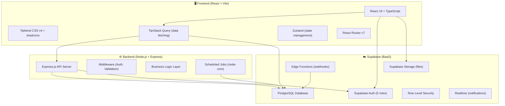

# Hệ thống Quản lý Dịch vụ Lưu trú HomeStay Dorm

Đồ án thực hành môn **Phân tích Thiết kế Hệ thống Thông tin (PTTK HTTT)** - Nhóm 3 - Lớp CQ2023/1.
Hệ thống được thiết kế để quản lý toàn bộ quy trình vận hành ký túc xá/homestay dorm từ lúc khách hàng tìm phòng, đặt cọc, ký hợp đồng, bàn giao tài sản cho đến khi trả phòng và thanh lý đối soát hoàn cọc.

## 👥 Thông Tin Nhóm (Nhóm 3 - CQ2023/1)

| MSSV | Họ và tên | Vai trò |
|------|-----------|---------|
| 23120189 | Hoàng Quốc Việt | Thành viên |
| 23120193 | Trần Kim Yến | **Trưởng nhóm** |
| 23120201 | Nguyễn Thị Trúc Hằng | Phó nhóm |
| 23120209 | Lê Hoàng Nhật Anh | Thành viên |
| 23120237 | Lê Lâm Trí Đức | Thành viên |

---

## 📁 Tài liệu đính kèm (Project Documents)
Toàn bộ file đề bài và báo cáo phân tích thiết kế chi tiết được lưu trữ trong thư mục [documents/](file:///d:/HK6/PTTK/ProjectPTTK/documents):
*   [FIT_4.0_DATH_PTTK HTTT_2526.pdf](file:///d:/HK6/PTTK/ProjectPTTK/documents/FIT_4.0_DATH_PTTK%20HTTT_2526.pdf): Đề bài yêu cầu của đồ án.
*   [Nhom3_Report.docx](file:///d:/HK6/PTTK/ProjectPTTK/documents/Nhom3_Report.docx): Báo cáo chi tiết (Use Case, sơ đồ lớp thiết kế, sơ đồ tuần tự, thiết kế database...).

---

## 🏗️ Kiến trúc hệ thống (System Architecture)

Hệ thống được thiết kế theo mô hình client-server 3 lớp (3-tier) kết hợp với dịch vụ đám mây (BaaS) từ Supabase nhằm tăng tốc thời gian phát triển và đảm bảo hiệu năng.



### Chi tiết các quyết định kiến trúc:

*   **Supabase Auth**: Sử dụng xác thực người dùng tích hợp sẵn cho 5 nhóm vai trò (Customer, Sale, Accountant, Manager, Admin). Tiết kiệm thời gian tự thiết lập JWT và mã hóa mật khẩu.
*   **Supabase Row Level Security (RLS)**: Cơ chế phân quyền bảo mật dữ liệu trực tiếp ở mức cơ sở dữ liệu. Khách hàng chỉ truy cập được dữ liệu của chính mình, nhân viên chi nhánh nào chỉ thấy dữ liệu của chi nhánh đó.
*   **Express.js API Server**: Dành riêng cho việc xử lý các nghiệp vụ (Business Logic) phức tạp như tính toán tỷ lệ hoàn cọc khi hủy hợp đồng trước hạn, tính toán khấu trừ tài sản hư hỏng, lập hóa đơn tự động định kỳ, và xuất các file PDF/biên bản bàn giao.
*   **TanStack Query & Zustand**: Tận dụng cơ chế caching và đồng bộ hóa server state của TanStack Query, kết hợp Zustand gọn nhẹ để quản lý client state (auth session, cấu hình theme, trạng thái sidebar/filter).

---

## 🚀 Hướng dẫn cài đặt và cấu hình (Local Development)

Để chuẩn bị môi trường lập trình local, hãy đảm bảo máy bạn đã cài đặt **Node.js** (v18 hoặc v20) và công cụ quản lý thư viện **pnpm** (`npm i -g pnpm`).

### 1. Tải dự án và cài đặt thư viện
Mở Terminal ở thư mục làm việc của bạn và chạy:
```bash
# Clone repository về máy
git clone https://github.com/liberosis121/Homestay-Dorm.git
cd Homestay-Dorm

# Cài đặt toàn bộ thư viện cho cả Frontend và Backend (Monorepo)
pnpm install
```

### 2. Cấu hình biến môi trường (.env)
Bạn cần tạo các file cấu hình môi trường sau ở máy local:

*   **Tại Backend (`apps/backend/.env`)**: Tạo file `.env` và nhập cấu hình:
    ```env
    PORT=3001
    SUPABASE_URL=https://mtbhyikorukkxjkrabgt.supabase.co
    SUPABASE_SERVICE_ROLE_KEY=[Liên hệ Yến để lấy Service Role Key bảo mật]
    ```

*   **Tại Frontend (`apps/frontend/.env.local`)**: Tạo file `.env.local` và nhập cấu hình:
    ```env
    VITE_SUPABASE_URL=https://mtbhyikorukkxjkrabgt.supabase.co
    VITE_SUPABASE_ANON_KEY=[Liên hệ Yến để lấy Anon Key bảo mật]
    VITE_API_URL=http://localhost:3001
    ```

### 3. Chạy dự án dưới local
Từ thư mục gốc của dự án, bạn có thể chạy đồng thời cả Frontend và Backend bằng lệnh song song:
```bash
pnpm dev
```
*   **Giao diện Frontend (Vite)** sẽ chạy tại: `http://localhost:5173`
*   **Server Backend (Express)** sẽ chạy tại: `http://localhost:3001`

*(Nếu bạn muốn chạy riêng lẻ từng ứng dụng, sử dụng lệnh: `pnpm --filter frontend dev` hoặc `pnpm --filter backend dev`).*

### 4. Tài khoản kiểm thử (Password mặc định: `123456`)
Dữ liệu mẫu đã được nạp sẵn vào CSDL Supabase, bạn có thể đăng nhập trực tiếp:
*   **Quản lý (Manager):** `manager@homestay.vn`
*   **Kế toán (Accountant):** `accountant@homestay.vn`
*   **Nhân viên Sale:** `sale@homestay.vn`
*   **Khách hàng (Customer):** `customer1@gmail.com`

---

## 📂 Cấu trúc thư mục dự án

```
ProjectPTTK/
├── 📁 apps/
│   ├── 📁 frontend/                     # React Frontend (Vite)
│   │   ├── 📁 public/                   # Tài nguyên tĩnh
│   │   ├── 📁 src/
│   │   │   ├── 📁 assets/               # Hình ảnh, font chữ
│   │   │   ├── 📁 components/           # Component UI dùng chung (shadcn/ui, layout)
│   │   │   ├── 📁 features/             # Module tính năng phân theo tác nhân
│   │   │   │   ├── 📁 landing/         # Giao diện Landing Page (Luxe Green Dormitory)
│   │   │   │   ├── 📁 auth/            # Đăng nhập, Profile (UC33-35)
│   │   │   │   ├── 📁 customer/        # Chức năng dành cho khách hàng (UC1-9)
│   │   │   │   ├── 📁 sale/            # Chức năng của nhân viên Sale (UC10-12)
│   │   │   │   ├── 📁 manager/         # Chức năng của Quản lý chi nhánh (UC18-24)
│   │   │   │   ├── 📁 accountant/      # Chức năng của Kế toán (UC13-17)
│   │   │   │   └── 📁 admin/           # Trang quản trị danh mục hệ thống (UC25-32)
│   │   │   ├── 📁 lib/                 # Mock database client (`supabaseClient.ts`)
│   │   │   ├── 📁 stores/              # Quản lý state toàn cục (Zustand)
│   │   │   └── App.tsx                 # Cấu hình routes & luồng điều hướng chính
│   │   └── index.html
│   │
│   └── 📁 backend/                      # Node.js Backend (Express)
│       └── 📁 src/
│           ├── 📁 routes/               # API Router
│           ├── 📁 services/             # Lớp xử lý nghiệp vụ (BUS/BLL)
│           └── 📁 repositories/         # Lớp truy vấn dữ liệu (DAL)
│
├── 📁 packages/
│   └── 📁 shared/                       # Thư viện dùng chung (types, schemas validator)
│
├── 📁 documents/                        # Thư mục lưu tài liệu đồ án (.pdf, .docx)
│   ├── FIT_4.0_DATH_PTTK HTTT_2526.pdf
│   └── Nhom3_Report.docx
│
├── 📁 supabase/                         # Cấu hình CSDL Supabase và migrations SQL
│
├── package.json                         # File quản lý workspace gốc
├── pnpm-workspace.yaml                  # Khai báo cấu trúc monorepo
└── README.md
```

---

## 📊 Tổng quan phân tích hệ thống

### 👥 Các tác nhân chính (Actors)
1.  **Khách hàng (Customer)**: Tra cứu thông tin, đăng ký thuê phòng, đặt cọc, gửi yêu cầu trả phòng, thanh toán hóa đơn.
2.  **Nhân viên Sale (Sale)**: Tiếp nhận đăng ký, lên lịch xem phòng cho khách, soạn thảo và lập hợp đồng thuê.
3.  **Kế toán (Accountant)**: Lập các loại hóa đơn (cọc, nhận phòng, định kỳ), tính toán bảng đối soát khấu trừ tài sản và thực hiện hoàn cọc.
4.  **Quản lý (Manager)**: Phê duyệt chứng từ đặt cọc, xác minh điều kiện lưu trú, thực hiện bàn giao/kiểm kê tài sản, cập nhật trạng thái phòng.
5.  **Quản trị viên (Admin)**: Quản trị các danh mục dùng chung (khách hàng, nhân viên, chi nhánh, dịch vụ, tài sản, phòng) và sao lưu/phục hồi hệ thống.

### 📋 Danh sách 35 Use Cases nghiệp vụ

| Phân nhóm | Số lượng | Các chức năng chính |
|-----------|----------|---------------------|
| **Khách hàng** | 9 Use Cases | Đăng ký thuê, đăng ký cọc, báo trả phòng, thanh toán, tra cứu (lịch hẹn, HĐ, dịch vụ, phòng, hóa đơn) |
| **Nhân viên Sale**| 3 Use Cases | Lập lịch xem phòng, lập hợp đồng thuê, tra cứu hồ sơ khách hàng |
| **Kế toán** | 5 Use Cases | Lập các loại hóa đơn (đặt cọc, nhận phòng, định kỳ), lập bảng đối soát hoàn cọc, xử lý hoàn cọc |
| **Quản lý** | 7 Use Cases | Duyệt cọc, check điều kiện lưu trú, bàn giao tài sản, kiểm kê tài sản, quản lý phòng/giường/tài sản |
| **Quản trị viên** | 8 Use Cases | CRUD Khách hàng, Nhân viên, Chi nhánh, Dịch vụ, Tài sản, Phòng, Điều kiện lưu trú; Sao lưu & Phục hồi |
| **Dùng chung** | 3 Use Cases | Đăng nhập, Đăng xuất, Quản lý tài khoản cá nhân |

---

## 📅 Kế hoạch triển khai dự án (Chiến lược Frontend-First / Mock-Driven)

Dự án ưu tiên hoàn thiện lớp giao diện và trải nghiệm tương tác (Frontend UI/UX) để demo nghiệp vụ trước, sau đó xây dựng hệ thống cơ sở dữ liệu và tích hợp API thật ở các bước tiếp theo.

### PHẦN 1: PHÁT TRIỂN FRONTEND MOCK-DRIVEN (Mô phỏng 35 Use Cases)
*   **Phase 0 — Foundation, Setup & Landing Page**: Cấu hình khung monorepo, tích hợp thiết kế Landing Page từ Stitch, dựng layout shell sidebar co giãn và cấu trúc mock client.
*   **Phase 1 — Auth & Phân quyền Router**: Phát triển form đăng nhập kính mờ, lưu session giả lập ở LocalStorage và xây dựng router guard chặn truy cập chéo vai trò.
*   **Phase 2 — Luồng Đăng ký & Đặt cọc**: Xây dựng trang tra cứu bộ lọc phòng, form đăng ký thuê, màn hình xếp lịch xem phòng của Sale.
*   **Phase 3 — Admin CRUD**: Hoàn thiện Component `DataTable` dùng chung và viết 8 trang quản trị danh mục dữ liệu của Admin.
*   **Phase 4 — Nghiệp vụ Nhận phòng & Hợp đồng**: Phê duyệt chứng từ cọc, kiểm tra điều kiện lưu trú, wizard form lập hợp đồng và checklist bàn giao tài sản hỗ trợ chữ ký điện tử.
*   **Phase 5 — Hóa đơn, Kiểm kê & Trả phòng**: Lập hóa đơn định kỳ (điện nước), thanh toán trực tuyến qua QR, checklist kiểm kê hư hỏng và bảng đối soát thanh lý hợp đồng.
*   **Phase 6 — Polish & Deployment**: Tối ưu UI/UX, responsive toàn bộ màn hình, xử lý loading/empty state và tạo trang `/demo-setup` (1-click tạo data mẫu).

### PHẦN 2: PHÁT TRIỂN BACKEND & TÍCH HỢP HỆ THỐNG
*   **Giai đoạn 1 — Database & Supabase Setup**: Khởi tạo database Supabase local/cloud, viết mã migrations SQL khởi tạo 25 bảng thực thể, enums, indexes và chính sách bảo mật RLS.
*   **Giai đoạn 2 — Backend API Services**: Phát triển API server bằng Express (Node.js) với cơ chế xác thực JWT, cấu trúc phân tầng Repository (DAL) và Service (BLL) xử lý tính toán hóa đơn, hoàn cọc, phạt vi phạm và scheduled job hủy cọc sau 24h.
*   **Giai đoạn 3 — Tích hợp API & Kiểm thử**: Thay thế mock database bằng API thực tế, kiểm thử bảo mật phân quyền chéo, chạy E2E tests bằng Playwright và đóng gói triển khai.

---

## 🔁 Git Workflow (Quy trình làm việc nhóm)

Để tránh tình trạng xung đột mã nguồn (Merge Conflict) và giữ cho lịch sử commit gọn gàng, nhóm chúng ta sẽ áp dụng quy trình làm việc theo **Tính năng (Feature-based Branching)** thay vì gộp chung code theo tên thành viên:

### 1. Các nhánh chính
*   **`main`**: Nhánh chạy bản Product chính thức (Dùng để demo, báo cáo cuối môn). Cấm commit trực tiếp lên nhánh này.
*   **`dev`**: Nhánh phát triển chung của cả nhóm. Code của tất cả thành viên sau khi hoàn thành sẽ được gộp vào đây. Cấm commit trực tiếp lên nhánh này.

### 2. Nhánh tính năng (`feature/[tên-tính-năng]`)
Mỗi khi làm một task/chức năng mới, thành viên tự tạo một nhánh riêng từ `dev`.
*   *Cú pháp:* `feature/tên-chức-năng`
*   *Ví dụ:* `feature/quan-ly-phong`, `feature/auth-backend`, `feature/lap-hoa-don`.
*   **Lợi ích:** Tránh xung đột code; nếu một tính năng của bạn bị lỗi hoặc chưa hoàn thành, nó sẽ không ảnh hưởng đến những tính năng khác đã hoàn thành và chuẩn bị merge vào `dev`.

### 3. Quy trình làm việc 4 bước chi tiết

#### 📌 Bước 1: Đồng bộ code mới nhất
Trước khi bắt đầu code tính năng mới, chuyển về nhánh `dev` và kéo code mới nhất của nhóm về máy:
```bash
git checkout dev
git pull origin dev
```

#### 📌 Bước 2: Tạo nhánh tính năng mới
Tạo nhánh mới từ `dev` để bắt đầu code:
```bash
git checkout -b ten-branch
```

#### 📌 Bước 3: Commit và Push code lên GitHub
Trong quá trình code, hãy thường xuyên commit kèm thông điệp có ý nghĩa:
```bash
git add .
git commit -m "feat: thêm giao diện lập hóa đơn điện nước"
git push origin feature/ten-chức-năng-cua-ban
```

#### 📌 Bước 4: Tạo Pull Request (PR) và Duyệt code
1.  Truy cập vào repository GitHub của dự án, bạn sẽ thấy gợi ý tạo **Pull Request (PR)** từ nhánh bạn vừa push vào nhánh `dev`.
2.  Tạo PR và báo Trưởng nhóm (Yến) review duyệt code.
3.  Sau khi PR được duyệt và merge thành công vào `dev`, bạn có thể xóa nhánh tính năng đó đi cho gọn repository.

---

## 🌐 Đường link chạy thử Online (Production)

Hệ thống được deploy tự động (CI/CD) mỗi khi có code mới được gộp vào nhánh `main`:
*   **Giao diện ứng dụng (Frontend - Vercel)**: [https://homestay-dorm-frontend.vercel.app](https://homestay-dorm-frontend.vercel.app)
*   **Địa chỉ API Server (Backend - Render)**: [https://homestay-dorm.onrender.com](https://homestay-dorm.onrender.com)
