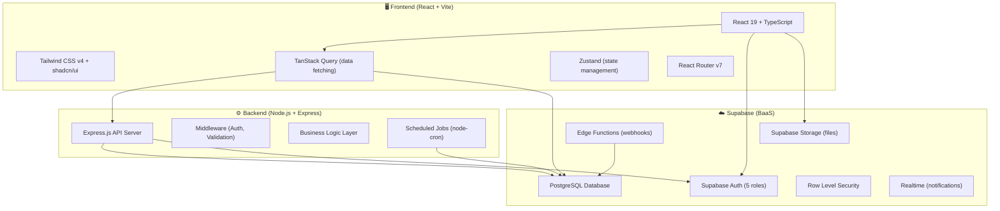

# Hệ thống Quản lý Dịch vụ Lưu trú HomeStay Dorm

Đồ án thực hành môn **Phân tích Thiết kế Hệ thống Thông tin (PTTK HTTT)** - Nhóm 3 - Lớp CQ2023/1.
Hệ thống được thiết kế để quản lý toàn bộ quy trình vận hành ký túc xá/homestay dorm từ lúc khách hàng tìm phòng, đặt cọc, ký hợp đồng, bàn giao tài sản cho đến khi trả phòng và thanh lý đối soát hoàn cọc.

## 👥 Thông Tin Nhóm (Nhóm 3 - CQ2023/1)

| MSSV | Họ và tên | Vai trò |
|------|-----------|---------|
| 23120189 | Hoàng Quốc Việt | Thành viên |
| 23120193 | Trần Kim Yến | **Trưởng nhóm** |
| 23120201 | Nguyễn Thị Trúc Hằng | Phó nhóm |
| 23120209 | Lê Hoàng Nhật Anh | Thành viên |
| 23120237 | Lê Lâm Trí Đức | Thành viên |

---

## 📁 Tài liệu đính kèm (Project Documents)
Toàn bộ file đề bài và báo cáo phân tích thiết kế chi tiết được lưu trữ trong thư mục [documents/](file:///d:/HK6/PTTK/ProjectPTTK/documents):
*   [FIT_4.0_DATH_PTTK HTTT_2526.pdf](file:///d:/HK6/PTTK/ProjectPTTK/documents/FIT_4.0_DATH_PTTK%20HTTT_2526.pdf): Đề bài yêu cầu của đồ án.
*   [Nhom3_Report.docx](file:///d:/HK6/PTTK/ProjectPTTK/documents/Nhom3_Report.docx): Báo cáo chi tiết (Use Case, sơ đồ lớp thiết kế, sơ đồ tuần tự, thiết kế database...).

---

## 🏗️ Kiến trúc hệ thống (System Architecture)

Hệ thống được thiết kế theo mô hình client-server 3 lớp (3-tier) kết hợp với dịch vụ đám mây (BaaS) từ Supabase nhằm tăng tốc thời gian phát triển và đảm bảo hiệu năng.



### Chi tiết các quyết định kiến trúc:

*   **Supabase Auth**: Sử dụng xác thực người dùng tích hợp sẵn cho 5 nhóm vai trò (Customer, Sale, Accountant, Manager, Admin). Tiết kiệm thời gian tự thiết lập JWT và mã hóa mật khẩu.
*   **Supabase Row Level Security (RLS)**: Cơ chế phân quyền bảo mật dữ liệu trực tiếp ở mức cơ sở dữ liệu. Khách hàng chỉ truy cập được dữ liệu của chính mình, nhân viên chi nhánh nào chỉ thấy dữ liệu của chi nhánh đó.
*   **Express.js API Server**: Dành riêng cho việc xử lý các nghiệp vụ (Business Logic) phức tạp như tính toán tỷ lệ hoàn cọc khi hủy hợp đồng trước hạn, tính toán khấu trừ tài sản hư hỏng, lập hóa đơn tự động định kỳ, và xuất các file PDF/biên bản bàn giao.
*   **TanStack Query & Zustand**: Tận dụng cơ chế caching và đồng bộ hóa server state của TanStack Query, kết hợp Zustand gọn nhẹ để quản lý client state (auth session, cấu hình theme, trạng thái sidebar/filter).

---

## 🚀 Hướng dẫn cài đặt và chạy thử (Local Development)

Đảm bảo máy đã cài đặt **Node.js** (Khuyên dùng v18 hoặc v20) và **pnpm** (`npm i -g pnpm`).

```bash
# 1. Clone repository về máy
git clone <repository_url>
cd ProjectPTTK

# 2. Cài đặt các package phụ thuộc cho toàn bộ workspace
pnpm install

# 3. Khởi chạy dự án ở chế độ phát triển (chạy Frontend Demo)
pnpm --filter frontend dev
```

Ứng dụng sẽ chạy tại địa chỉ: `http://localhost:5173`. 
Bạn có thể đăng nhập bằng các tài khoản test có sẵn hiển thị trên màn hình `/login` hoặc dùng thanh chuyển đổi vai trò nhanh (Demo Switcher) ở thanh công cụ phía trên cùng.

---

## 📂 Cấu trúc thư mục dự án

```
ProjectPTTK/
├── 📁 apps/
│   ├── 📁 frontend/                     # React Frontend (Vite)
│   │   ├── 📁 public/                   # Tài nguyên tĩnh
│   │   ├── 📁 src/
│   │   │   ├── 📁 assets/               # Hình ảnh, font chữ
│   │   │   ├── 📁 components/           # Component UI dùng chung (shadcn/ui, layout)
│   │   │   ├── 📁 features/             # Module tính năng phân theo tác nhân
│   │   │   │   ├── 📁 landing/         # Giao diện Landing Page (Luxe Green Dormitory)
│   │   │   │   ├── 📁 auth/            # Đăng nhập, Profile (UC33-35)
│   │   │   │   ├── 📁 customer/        # Chức năng dành cho khách hàng (UC1-9)
│   │   │   │   ├── 📁 sale/            # Chức năng của nhân viên Sale (UC10-12)
│   │   │   │   ├── 📁 manager/         # Chức năng của Quản lý chi nhánh (UC18-24)
│   │   │   │   ├── 📁 accountant/      # Chức năng của Kế toán (UC13-17)
│   │   │   │   └── 📁 admin/           # Trang quản trị danh mục hệ thống (UC25-32)
│   │   │   ├── 📁 lib/                 # Mock database client (`supabaseClient.ts`)
│   │   │   ├── 📁 stores/              # Quản lý state toàn cục (Zustand)
│   │   │   └── App.tsx                 # Cấu hình routes & luồng điều hướng chính
│   │   └── index.html
│   │
│   └── 📁 backend/                      # Node.js Backend (Express)
│       └── 📁 src/
│           ├── 📁 routes/               # API Router
│           ├── 📁 services/             # Lớp xử lý nghiệp vụ (BUS/BLL)
│           └── 📁 repositories/         # Lớp truy vấn dữ liệu (DAL)
│
├── 📁 packages/
│   └── 📁 shared/                       # Thư viện dùng chung (types, schemas validator)
│
├── 📁 documents/                        # Thư mục lưu tài liệu đồ án (.pdf, .docx)
│   ├── FIT_4.0_DATH_PTTK HTTT_2526.pdf
│   └── Nhom3_Report.docx
│
├── 📁 supabase/                         # Cấu hình CSDL Supabase và migrations SQL
│
├── package.json                         # File quản lý workspace gốc
├── pnpm-workspace.yaml                  # Khai báo cấu trúc monorepo
└── README.md
```

---

## 📊 Tổng quan phân tích hệ thống

### 👥 Các tác nhân chính (Actors)
1.  **Khách hàng (Customer)**: Tra cứu thông tin, đăng ký thuê phòng, đặt cọc, gửi yêu cầu trả phòng, thanh toán hóa đơn.
2.  **Nhân viên Sale (Sale)**: Tiếp nhận đăng ký, lên lịch xem phòng cho khách, soạn thảo và lập hợp đồng thuê.
3.  **Kế toán (Accountant)**: Lập các loại hóa đơn (cọc, nhận phòng, định kỳ), tính toán bảng đối soát khấu trừ tài sản và thực hiện hoàn cọc.
4.  **Quản lý (Manager)**: Phê duyệt chứng từ đặt cọc, xác minh điều kiện lưu trú, thực hiện bàn giao/kiểm kê tài sản, cập nhật trạng thái phòng.
5.  **Quản trị viên (Admin)**: Quản trị các danh mục dùng chung (khách hàng, nhân viên, chi nhánh, dịch vụ, tài sản, phòng) và sao lưu/phục hồi hệ thống.

### 📋 Danh sách 35 Use Cases nghiệp vụ

| Phân nhóm | Số lượng | Các chức năng chính |
|-----------|----------|---------------------|
| **Khách hàng** | 9 Use Cases | Đăng ký thuê, đăng ký cọc, báo trả phòng, thanh toán, tra cứu (lịch hẹn, HĐ, dịch vụ, phòng, hóa đơn) |
| **Nhân viên Sale**| 3 Use Cases | Lập lịch xem phòng, lập hợp đồng thuê, tra cứu hồ sơ khách hàng |
| **Kế toán** | 5 Use Cases | Lập các loại hóa đơn (đặt cọc, nhận phòng, định kỳ), lập bảng đối soát hoàn cọc, xử lý hoàn cọc |
| **Quản lý** | 7 Use Cases | Duyệt cọc, check điều kiện lưu trú, bàn giao tài sản, kiểm kê tài sản, quản lý phòng/giường/tài sản |
| **Quản trị viên** | 8 Use Cases | CRUD Khách hàng, Nhân viên, Chi nhánh, Dịch vụ, Tài sản, Phòng, Điều kiện lưu trú; Sao lưu & Phục hồi |
| **Dùng chung** | 3 Use Cases | Đăng nhập, Đăng xuất, Quản lý tài khoản cá nhân |

---

## 📅 Kế hoạch triển khai dự án (Chiến lược Frontend-First / Mock-Driven)

Dự án ưu tiên hoàn thiện lớp giao diện và trải nghiệm tương tác (Frontend UI/UX) để demo nghiệp vụ trước, sau đó xây dựng hệ thống cơ sở dữ liệu và tích hợp API thật ở các bước tiếp theo.

### PHẦN 1: PHÁT TRIỂN FRONTEND MOCK-DRIVEN (Mô phỏng 35 Use Cases)
*   **Phase 0 — Foundation, Setup & Landing Page**: Cấu hình khung monorepo, tích hợp thiết kế Landing Page từ Stitch, dựng layout shell sidebar co giãn và cấu trúc mock client.
*   **Phase 1 — Auth & Phân quyền Router**: Phát triển form đăng nhập kính mờ, lưu session giả lập ở LocalStorage và xây dựng router guard chặn truy cập chéo vai trò.
*   **Phase 2 — Luồng Đăng ký & Đặt cọc**: Xây dựng trang tra cứu bộ lọc phòng, form đăng ký thuê, màn hình xếp lịch xem phòng của Sale.
*   **Phase 3 — Admin CRUD**: Hoàn thiện Component `DataTable` dùng chung và viết 8 trang quản trị danh mục dữ liệu của Admin.
*   **Phase 4 — Nghiệp vụ Nhận phòng & Hợp đồng**: Phê duyệt chứng từ cọc, kiểm tra điều kiện lưu trú, wizard form lập hợp đồng và checklist bàn giao tài sản hỗ trợ chữ ký điện tử.
*   **Phase 5 — Hóa đơn, Kiểm kê & Trả phòng**: Lập hóa đơn định kỳ (điện nước), thanh toán trực tuyến qua QR, checklist kiểm kê hư hỏng và bảng đối soát thanh lý hợp đồng.
*   **Phase 6 — Polish & Deployment**: Tối ưu UI/UX, responsive toàn bộ màn hình, xử lý loading/empty state và tạo trang `/demo-setup` (1-click tạo data mẫu).

### PHẦN 2: PHÁT TRIỂN BACKEND & TÍCH HỢP HỆ THỐNG
*   **Giai đoạn 1 — Database & Supabase Setup**: Khởi tạo database Supabase local/cloud, viết mã migrations SQL khởi tạo 25 bảng thực thể, enums, indexes và chính sách bảo mật RLS.
*   **Giai đoạn 2 — Backend API Services**: Phát triển API server bằng Express (Node.js) với cơ chế xác thực JWT, cấu trúc phân tầng Repository (DAL) và Service (BLL) xử lý tính toán hóa đơn, hoàn cọc, phạt vi phạm và scheduled job hủy cọc sau 24h.
*   **Giai đoạn 3 — Tích hợp API & Kiểm thử**: Thay thế mock database bằng API thực tế, kiểm thử bảo mật phân quyền chéo, chạy E2E tests bằng Playwright và đóng gói triển khai.

---

## 🔁 Git Workflow

Quy trình làm việc với Git cho các thành viên trong dự án nhằm đảm bảo quản lý mã nguồn an toàn và tránh xung đột:

### 1. Phân loại nhánh (Branch Strategy)
*   **`main`**: Nhánh stable chỉ dùng cho sản phẩm cuối cùng (báo cáo, triển khai thực tế). **Tuyệt đối không commit hay phát triển trực tiếp trên nhánh này**.
*   **`dev`**: Nhánh tích hợp (integration) của cả nhóm. Mọi tính năng hoàn thành sẽ được merge vào đây trước để kiểm thử. **Không commit trực tiếp lên dev**.
*   **Các nhánh tính năng (`feature branches`)**: Nhánh làm việc riêng của từng thành viên, được tạo ra từ `dev`.
    *   *Quy tắc đặt tên nhánh tính năng:* `<tên-thành-viên>-<tên-chức-năng>`. Ví dụ: `kyen-fe`, `member-login`, `member-booking`, `member-backend`.

### 2. Sơ đồ nhánh
```
main
└── dev
    ├── kyen-fe
    ├── member-login
    ├── member-backend
    └── member-admin
```

### 3. Quy trình phát triển (Workflow các bước)

#### Bước 1: Chuẩn bị nhánh làm việc
Trước khi code bất kỳ chức năng nào, hãy chuyển sang nhánh cá nhân của bạn và kéo code mới nhất từ nhánh `dev` về để tránh xung đột:
```bash
# Chuyển sang nhánh cá nhân (ví dụ kyen-fe)
git checkout kyen-fe

# Cập nhật code mới nhất từ dev
git pull origin dev
```

#### Bước 2: Commit và Push thay đổi
Chỉ làm việc trên nhánh cá nhân của bạn, sau đó commit kèm theo commit message có ý nghĩa:
```bash
# Add file thay đổi
git add .

# Commit thay đổi
git commit -m "feat: thêm giao diện đăng nhập và đổi mật khẩu"

# Push nhánh lên remote repository
git push origin kyen-fe
```

#### Bước 3: Tạo Pull Request (PR)
Khi tính năng hoàn thành và đã kiểm thử chạy tốt ở local:
1. Tạo một Pull Request trên GitHub từ nhánh tính năng của bạn vào nhánh `dev` (ví dụ: `kyen-fe` -> `dev`).
2. Nhóm sẽ review code, giải quyết xung đột (conflict nếu có) và duyệt PR để tích hợp.
3. Sau khi tích hợp và chạy thử ổn định trên nhánh `dev`, code từ `dev` mới được merge vào nhánh `main` để release (`dev` -> `main`).
