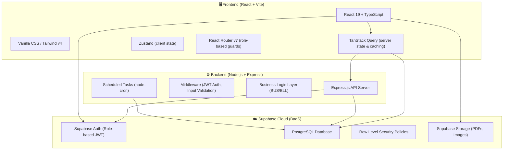
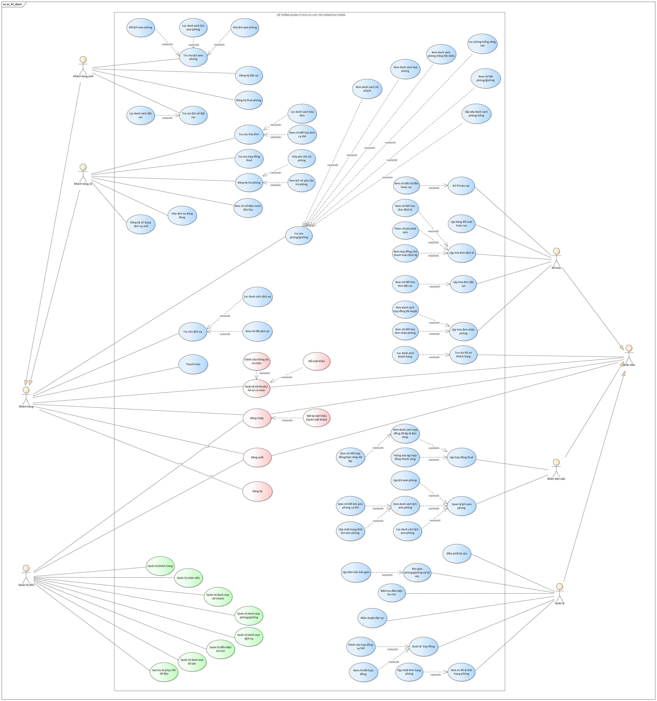

# HomeStay Dorm - Dormitory and Accommodation Management System

An advanced, end-to-end management solution designed for modern dormitory and shared-living (homestay dorm) operations. This project is developed as the practical project for the **Information Systems Analysis and Design (ISAD / PTTK HTTT)** course - Group 3 - Class CQ2023/1.

The system automates the entire lifecycle of student and tenant residency, starting from room browsing and booking, through contract drafting, check-in asset handovers, monthly utility billing, to final check-out inspections, damage deductions, and deposit refunds.

---

## 👥 Team Information (Group 3 - Class CQ2023/1)

| Student ID | Full Name | Actual Role & Project Contributions |
| :--- | :--- | :--- |
| **23120193** | **Trần Kim Yến** | **Project Leader & UI/UX Designer**, DevOps (CI/CD & Deployment Setup), Auth & New Customer Flow Developer |
| **23120201** | **Nguyễn Thị Trúc Hằng** | **Deputy Leader & Lead Tester**, Old Customer Flow & Admin Feature Developer |
| **23120189** | **Hoàng Quốc Việt** | **Full-Stack Developer & Lead Tester**, Sale Visit Flow & Admin Feature Developer |
| **23120209** | **Lê Hoàng Nhật Anh** | **Frontend Developer & Asset Specialist**, Manager Asset Handover/Inspection & Staff Profile Developer |
| **23120237** | **Lê Lâm Trí Đức** | **Full-Stack Developer & Billing Specialist**, Accountant Utility Billing & Refund/Payout Developer |

---

## 📁 Project Documents
All requirements, analysis, and system design specifications are stored under the [documents/](file:///d:/HK6/PTTK/ProjectPTTK/documents) directory:
*   [FIT_4.0_DATH_PTTK HTTT_2526.pdf](file:///d:/HK6/PTTK/ProjectPTTK/documents/FIT_4.0_DATH_PTTK%20HTTT_2526.pdf): Original project specifications and requirements.
*   [Nhom3_Report.docx](file:///d:/HK6/PTTK/ProjectPTTK/documents/Nhom3_Report.docx): Comprehensive system design report (containing detailed Use Case specifications, Class Diagrams, Sequence Diagrams, ERD, and UI mockups).

---

## 🏗️ System Architecture

The project is structured as a **3-tier Client-Server architecture** built on top of a Cloud Backend-as-a-Service (BaaS) provider (Supabase) to balance rapid development with enterprise-grade data security and business logic isolation.



### Architectural Highlights:
*   **Decoupled Frontend-First Design**: The client application uses `Zustand` and `TanStack Query` to fetch and render mock data during prototype stages, allowing seamless integration with API endpoints once they are finalized.
*   **Role-Based Access Control (RBAC)**: Enforced via React Router guards on the frontend and custom policies on Supabase Auth. The system supports 5 user roles: *Customer*, *Sale Staff*, *Accountant*, *Branch Manager*, and *System Administrator*.
*   **Supabase Row Level Security (RLS)**: Protects data directly at the database layer. Tenants can only read their own contracts and invoices, whereas branch managers can only view data scoped to their physical branch.
*   **Express API Server**: Dedicated to complex transactional logic, such as automated contract liquidation calculations, prorated refund percentages, utility consumption charge generation, and scheduled tasks (e.g., automatically canceling unpaid reservations after 24 hours).

---

## 📂 Monorepo Directory Structure

The project is organized as a monorepo utilizing `pnpm workspaces` for efficient dependency sharing and codebase management.

```
Homestay-Dorm/
├── 📁 apps/
│   ├── 📁 frontend/                     # React Frontend (Vite)
│   │   ├── 📁 public/                   # Static assets & assets directory
│   │   └── 📁 src/
│   │       ├── 📁 components/           # Reusable UI components & layouts
│   │       ├── 📁 features/             # Business modules grouped by user roles
│   │       │   ├── 📁 landing/          # Public-facing Landing Page
│   │       │   ├── 📁 auth/             # Login, Register & Password Recovery
│   │       │   ├── 📁 customer/         # Tenant dashboard, requests & billing
│   │       │   ├── 📁 sale/             # Room view scheduling & contract editor
│   │       │   ├── 📁 manager/          # Approvals, check-ins, assets & rooms
│   │       │   ├── 📁 accountant/       # Invoices, billing, refund reconciliation
│   │       │   └── 📁 admin/            # Core system catalog CRUD
│   │       ├── 📁 lib/                  # API client & local DB manager
│   │       ├── 📁 stores/               # Zustand global store definitions
│   │       └── App.tsx                  # Main router configuration
│   │
│   └── 📁 backend/                      # Node.js API Server (Express)
│       └── 📁 src/
│           ├── 📁 routes/               # Express endpoints (API Routers)
│           ├── 📁 services/             # Business Logic Layer (BLL)
│           └── 📁 repositories/         # Data Access Layer (DAL)
│
├── 📁 documents/                        # Course reports, PDFs, and assets
├── 📁 supabase/                         # SQL Schema migrations & seed data
├── package.json                         # Root package config
├── pnpm-workspace.yaml                  # Monorepo workspace configuration
└── README.md                            # Project documentation
```

---

## 📊 Business Analysis & Use Cases

### 👥 System Actors
1.  **Customer (Tenant)**: Browses available beds, registers for room rentals, submits deposit reservations, requests checkout, and pays monthly bills online.
2.  **Sale Staff**: Follows up on rental registrations, schedules physical/virtual room visits, and drafts binding lease agreements.
3.  **Branch Manager**: Reviews and approves deposit proof, conducts move-in inspections and check-in asset handovers, performs room checks, and monitors facility maintenance.
4.  **Accountant**: Generates bills (deposits, check-in fees, monthly utilities), reconciles property damages, and processes security deposit refunds.
5.  **System Administrator (Admin)**: Manages central system catalogs (users, branches, room types, services, assets) and handles system backups/restores.

### 📋 Use Case Diagram
The system supports a comprehensive set of over 70 use cases to cover all requirements. Refer to the use case diagram below:



---

## ⚡ Core Feature Implementations

### 1. Automated Utility & Monthly Billing (Accountant)
*   **Automated Calculation**: The billing system calculates total utility fees (electricity, water) based on previous and current meter readings.
*   **Ad-Hoc Fee Integration**: Displays pending penalty fees or asset damage claims submitted by the Branch Manager (e.g., "broken showerhead replacement"). The Accountant must approve or reject these charges before finalizing the monthly invoice.
*   **Lifecycle Management**: Once finalized, a new `MonthlyInvoice` record is registered, and the lease agreement's payment cycle is incremented to the next month automatically.

### 2. Security Deposit Refund Reconciliation (Accountant)
*   **Variable Refund Percentages**: Allows the accountant to select base refund ratios according to company policies (e.g., 100% for full lease completion, 70% for early checkouts > 6 months, 50% for early checkouts < 6 months).
*   **Automated Deductions**: Consolidates unpaid utility balances, rent arrears, checkout cleaning fees, and damage claims.
*   **Net-Refund Computation**: Displays clear visual indicators showing whether the tenant will receive a refund (positive Net value) or if they owe the company additional funds (negative Net value).

### 3. Move-out Payout & Automated Room Release (Accountant / Manager)
*   **Flexible Payout Forms**: Captures cash payouts or bank transfers with account detail verification.
*   **Cascading Database Updates**: Confirming a deposit payout automatically updates the contract status to `expired`, marks the tenant profile room association as null, and changes the corresponding room/bed status back to `available` for incoming listings.

### 4. Interactive Room Status Grid (Manager)
*   **Interactive Visual Grid**: Displays room statuses (Occupied, Available, Deposited, Maintenance) dynamically by floor, updating in real-time.
*   **Quick Status Switcher**: A simplified overlay allows managers to flag rooms for maintenance or reset them to available.

### 5. Unified Customer Lookup Profile (Sale / Manager)
*   **Real-time Filters**: Instant lookup of customer history by Code, Name, ID/Passport, or Phone.
*   **Activity Timeline**: Displays a visual timeline of tenant history (e.g., "Contract signed on 2025-06-01", "Billing paid on 2025-07-15").

---

## ☁️ Database Design & Extensions

The system runs on **PostgreSQL** in Supabase. In addition to core entity tables (Users, Rooms, Contracts, Invoices), we designed the following database structures to support advanced business rules:

### A. Meter Readings Table (`MeterReadings`)
Tracks monthly resource consumption history per room to prevent manual accountant recalculation errors.
*   `id` (PK)
*   `room_id` (FK to `Rooms`)
*   `billing_period` (YYYY-MM)
*   `prev_electricity_meter` / `new_electricity_meter`
*   `prev_water_meter` / `new_water_meter`
*   `recorded_at`

### B. Ad-hoc Miscellaneous Expenses (`MiscExpenses`)
Stores intermediate damage claims or extra amenity charges before they are rolled into the final monthly invoice.
*   `id` (PK)
*   `contract_id` (FK to `LeaseContracts`)
*   `description` (e.g., "Replacing room keycard")
*   `amount` (Numerical)
*   `status` (`pending_approval`, `approved`, `invoiced`)
*   `created_by_staff_id` (FK to `Users`)

---

## ⚙️ CI/CD & Deployment

This project utilizes automated pipelines (CI/CD) to deploy changes immediately after code gets integrated into primary branches:
*   **Frontend Deployment (Vercel)**: Automatically builds and hosts the React application.
    *   **Live App URL**: [https://homestay-dorm-frontend.vercel.app](https://homestay-dorm-frontend.vercel.app)
*   **Backend API Server (Render)**: Automatically builds the Express server with zero-downtime rolling updates.
    *   **API Base URL**: [https://homestay-dorm.onrender.com](https://homestay-dorm.onrender.com)
*   **Continuous Integration**: Automated unit tests and static analysis trigger on every Pull Request to the `dev` branch.

---

## 🚀 Local Development Setup

Follow these instructions to run the project environment locally.

### Prerequisites
*   **Node.js** (version 18.x or 20.x recommended)
*   **pnpm** Package Manager (`npm i -g pnpm`)

### 1. Installation
Clone the repository and install all workspace dependencies:
```bash
git clone https://github.com/liberosis121/Homestay-Dorm.git
cd Homestay-Dorm
pnpm install
```

### 2. Environment Variables (.env)
You must create environment configuration files locally for both modules:

*   **Backend Config (`apps/backend/.env`)**:
    ```env
    PORT=3001
    SUPABASE_URL=https://mtbhyikorukkxjkrabgt.supabase.co
    SUPABASE_SERVICE_ROLE_KEY=[Request Service Role Key from Team Leader]
    ```

*   **Frontend Config (`apps/frontend/.env.local`)**:
    ```env
    VITE_SUPABASE_URL=https://mtbhyikorukkxjkrabgt.supabase.co
    VITE_SUPABASE_ANON_KEY=[Request Anon Key from Team Leader]
    VITE_API_URL=http://localhost:3001
    ```

### 3. Running Dev Servers
To boot both the Express server and Vite frontend concurrently:
```bash
pnpm dev
```
*   **Vite Frontend UI**: Running at [http://localhost:5173](http://localhost:5173)
*   **Express Backend API**: Running at [http://localhost:3001](http://localhost:3001)

*(To start servers individually, run `pnpm --filter frontend dev` or `pnpm --filter backend dev`).*

### 4. Credentials for testing (Default Password: `123456`)
Our Supabase database is pre-seeded with mock profiles. You can sign in using these pre-configured user credentials:
*   **Branch Manager**: `manager@homestay.vn`
*   **Accountant**: `accountant@homestay.vn`
*   **Sale Staff**: `sale@homestay.vn`
*   **Customer (Tenant)**: `customer1@gmail.com`

---

## 🔁 Git Workflow (Feature-Branching)

To maintain a clean and reliable codebase, our team adheres to the **Feature-Branching** Git Workflow:

1.  **Branch Hierarchy**:
    *   `main`: Holds release-ready production code. Direct commits are restricted.
    *   `develop`: Integration branch for active features. Direct commits are restricted.
    *   `[member-name]`: One dedicated development branch per member.
2.  **Pull Requests**: Features must be merged into `develop` via a Pull Request (PR) reviewed and approved by the Team Leader.
3.  **Local Syncing**: Developers pull changes from `origin/develop` regularly into their working branches to resolve merge conflicts early:
    ```bash
    git fetch --all
    git pull origin develop
    ```
